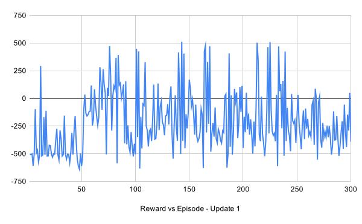
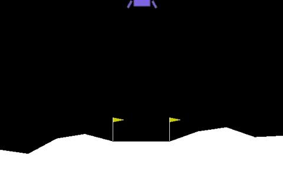
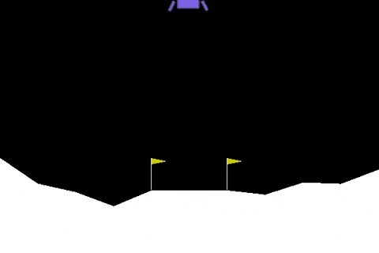
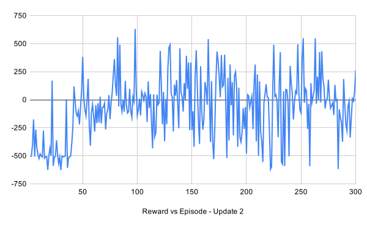
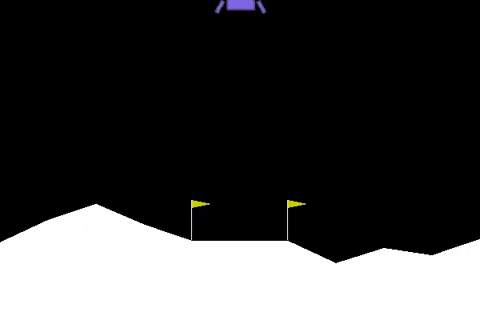
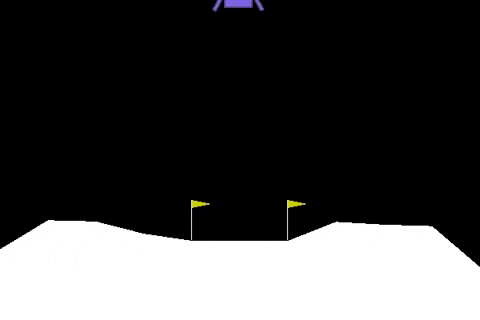

<h3>
  Katayoun Borojerdi
<h3>

<h1 align="center">
  Homework 11 - OpenAI
  
  Gym
</h1>

<h4 align="center">
  Training a Lunar Lander to properly land using a Jetson TX2.
</h4>

## Problem Description
There are two python scripts used to run the Lunar Lander Program.
```lunar_lander.py```
containes the OpenAI Gym Lunar Lander enviornment and the configuration of the keras Nueral Network model.

```run_lunar_lander.py```
calls both the the Lunar Lander environment and NN model, and contians the Reinforcement learning algorythm.

## Reinforcement Learning 
The default RL algorithm  seems to be a monte carlo method. Actions are randomly generated, and we use them to get coresponding states and rewards from the enviornment. We use that information to train our nuearl network. Once the netwrok is trained again we generate random actions, but now we feed those into our NN and estimate the reward. We choose that action withth highest reward and progress through the episode. periodiclly we re-trin the model, and over time the model improves and eventually becomes proficient at predicting r based on a given current state and action.

The problem with this model is that even after it is trained sufficently, it still relies on you feeding in random actions to find the maximum reward. it would be more efficient if our network could output the action. Also we are not including discount reward factor in this model. So there is no weight given to future reward. This may cause the model to spedn more time hoevering and learn to land and complete the espisode.

## About Lunar-Lander
The task is to land the space-ship between the flags smoothly. The ship has 3 throttles in it. One throttle points downward and other 2 points in the left and right direction. With the help of these, you have to control the Ship.

There are 2 different Lunar Lander Environment in OpenAIGym. One has discrete action space and other has continuous action space. For this problem we are useing the contiuous action sapce.

## LunarLanderContinuous-v2 (Continuous)
Landing pad is always at coordinates (0,0). Action is two real values vector from -1 to +1. First controls main engine, -1..0 off, 0..+1 throttle from 50% to 100% power. Engine can’t work with less than 50% power. Second value -1.0..-0.5 fire left engine, +0.5..+1.0 fire right engine, -0.5..0.5 off.

## Initial Baseline run
The initial run took about 8 hours to comoplete. It seemed to train okay. It was able to succesfully land once during the test run after training was complete. However It was difficult to quantify because the model was run by steps instead of episodes.

## First Model Update
The original RL algorithm generated actions between -1 and 1. However because all actions between -.5 and .5 mean the engins are off. I felt this would bias the actions and waste processing time. So I changed to generate numbers from .4 to 1 for the main enginer and +/- that same range for the side engines.

I also update the script to run by episode instead of just number of steps, so that I could better understand the total reward per episode. I added a max memory size for the input list to make sure I did not run out of memory. 

```
from collections import deque
self.memory = deque(maxlen=2000)
```

This also acts as a way to remove old training steps that are not as good for newer ones based on more accurate NN model. With this I was able to train the model for more total steps. I kept the NN the same for comparison to the basleine RL algorythm and ran it for about 3 times the total number of steps.

Following is the plot showing rewards per episode. The model seems to improve quickly, but then platues and actually seems to get worse at the end. Even if we run this model longer this does not seem to be an effective algorythm to consistantly solve the problem.

<div align="center">

 </div>


## Test Episode Videos First Model Update
Here are my 2 best episodes out of 10 test episodes I ran once the training was complete.
  
<div align="center">

<p>Episode from First Model Update</p>
</div>

<div align="center">

<p>Episode from First Model Update</p>
</div>

## Second Model Update
For my second model update I increased the size of the network and change to nadam optimizer. I reduced the number of iterations used for randomly calculating the actions per step from 100 to 50, and reduced the memory size from 50000 to 10000.

```
def nnmodel(input_dim):
    model = Sequential()
    model.add(Dense(32, input_dim=input_dim, activation='relu')) #default 32
    model.add(Dense(16, activation='relu')) #default 16
    model.add(Dense(1))
    model.compile(loss='mean_squared_error', optimizer='adam') #default adam, metrics=['accuracy']
    return model
```

Following is the plot showing rewards per episode. The model is an improvemenet over the first model. The average of the rewards is cloaser to 0 where before it was negative. Towards the end it seems to be performing more consistantly. I think if I ran this model longer and maybe tweeked some other parameters it would consistantly solve this problem.

<div align="center">

</div>

## Test Episode Videos Second Model Update
Here are my 2 best episodes out of 10 test episodes I ran once the training was complete.
  
<div align="center">

<p>Episode from Second Model Update</p>
</div>

<div align="center">

<p>Episode from Second Model Update</p>
</div>

## Additional Improvments and Potential Model Updates
Ther are several things that we could do to improve this RL Algorythm. If we could trim the training set to include episodes with better total reward it would likely result in better more consistant model. Also if we could rpedict on the actions instead of the reward we could train the model more quickly.

Also Looking into other methods that have been used on this problem, I looked into useing a DDQN algorythm to solve this problem. It seems like this approach could solve the problem more quickly than the method we used.
